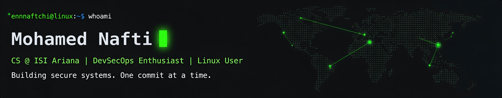

  

   

  <code><b>SYSTEM_STATUS:</b> OPERATIONAL</code> &nbsp; | &nbsp; 
  <code><b>FOCUS:</b> SYSTEMS_SECURITY</code> &nbsp; | &nbsp; 
  <code><b>LOCATION:</b> TUNIS_TN</code>

 

<table border="0" width="100%" cellpadding="10">
  <tr>
    <td width="50%" valign="top">
      <h3> [01] THE PERSPECTIVE</h3>
      
<b>"I break stuff. And I occasionally write about it."</b>

      
I am a CS student at ISI Ariana obsessed with the <b>"why"</b> behind the code. I don’t just build software; I build software designed to <b>survive an attack</b>.

    </td>
    <td width="50%" valign="top">
      <h3> [02] TECHNICAL FOCUS</h3>
      

        ▶ <b>Systems:</b> Low-level (C/C++), Linux Internals 
        ▶ <b>Security:</b> System Hardening, VAPT, CTF Research 
        ▶ <b>Infra:</b> DevSecOps, KVM/QEMU, Automation
      

    </td>
  </tr>
</table>

 

  <kbd><b>CORE TECH STACK</b></kbd>
    
  

  

  <table border="0">
    <tr>
      <td>
        
      </td>
      <td>
        
      </td>
    </tr>
  </table>

  

<table border="0" width="100%" cellpadding="10">
  <tr>
    <td width="50%" valign="top">
      <h3> [03] RECENT OPERATIONS</h3>
      <code>> [LOG] Security research in progress</code> 
      <code>> [LOG] System hardening lab initiated</code>
    </td>
    <td width="50%" valign="top" align="center">
      <h3>CONNECT_</h3>
      
      &nbsp;
      
      &nbsp;
      
    </td>
  </tr>
</table>

   
  

  
<i>"The best way to predict the future is to implement it." — Alan Kay</i>

