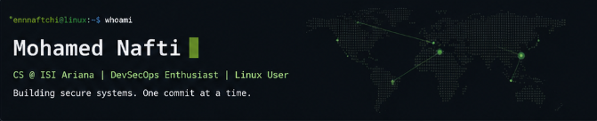

  

   

  
  
  

    

  <h1>Mohamed Nafti</h1>
  
<i>Software Engineering with a Security Mindset</i>

 

<table border="0" width="100%" cellpadding="10">
  <tr>
    <td width="60%" valign="top">
      <h3> [01] THE PERSPECTIVE</h3>
      
I specialize in understanding the <b>"why"</b> behind the code. My work exists at the intersection of high-performance development and offensive security.

      
I build efficient, scalable systems in <b>C++ and Python</b>, then apply an adversary's mindset to harden them against modern threat vectors. My goal is to bridge the gap between "it works" and "it's secure."

    </td>
    <td width="40%" valign="top">
      <h3> [02] TECHNICAL FOCUS</h3>
      <code><b>SYSTEMS</b></code> 
      Linux Internals, Low-level (C/C++)  
      <code><b>SECURITY</b></code> 
      System Hardening, VAPT, CTF  
      <code><b>INFRA</b></code> 
      DevSecOps, KVM/QEMU, Automation
    </td>
  </tr>
</table>

 

  
    
  

  

  <table border="0">
    <tr>
      <td>
        
      </td>
      <td>
        
      </td>
    </tr>
  </table>

  

<table border="0" width="100%" cellpadding="10">
  <tr border="0">
    <td width="55%" valign="top">
      <h3> [03] RECENT OPERATIONS</h3>
      <code>> Scanning local git logs...</code> 
      <code>> [LOG] Security research in progress</code> 
      <code>> [LOG] System hardening lab initiated</code>
      </td>
    <td width="45%" valign="top" align="right">
      <h3>CONNECT_</h3>
       
       
      
    </td>
  </tr>
</table>

 

  
   
  
"The best way to predict the future is to implement it." — Alan Kay

